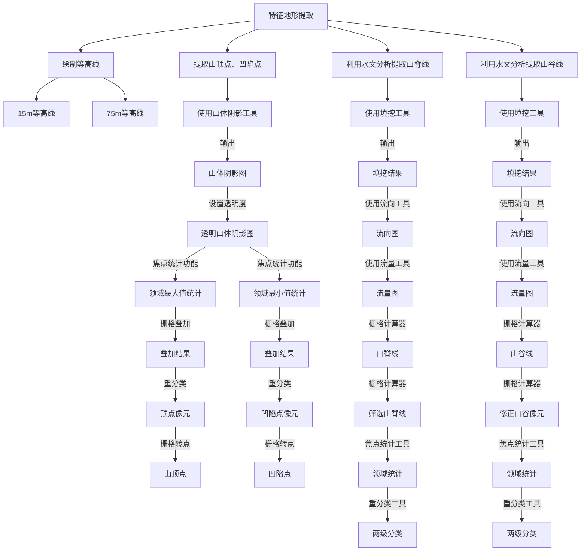

```mermaid
graph TD
    A[特征地形提取] --> B[绘制等高线]
   A --> C[提取山顶点、凹陷点]
    A --> D[利用水文分析提取山脊线]
    A --> E[利用水文分析提取山谷线]
    B[绘制等高线]--> B1[15m等高线]
    B[绘制等高线]--> B2[75m等高线]
    C[提取山顶点、凹陷点]-->C1[使用山体阴影工具]
    D[利用水文分析提取山脊线]-->D1[使用填挖工具]
    E[利用水文分析提取山谷线]-->E1[使用填挖工具]
     C1[使用山体阴影工具] -->|输出| C2[山体阴影图]
        C2 -->|设置透明度| C3[透明山体阴影图]
        C3 -->|焦点统计功能| C4[领域最大值统计]
        C4 -->|栅格叠加| C5[叠加结果]
        C5 -->|重分类| C6[顶点像元]
        C6 -->|栅格转点| C7[山顶点]
        C3 -->|焦点统计功能| C8[领域最小值统计]
        C8 -->|栅格叠加| C9[叠加结果]
        C9 -->|重分类| C10[凹陷点像元]
        C10 -->|栅格转点| C11[凹陷点]
         D1[使用填挖工具] -->|输出| D2[填挖结果]
        D2 -->|使用流向工具| D3[流向图]
        D3 -->|使用流量工具| D4[流量图]
        D4 -->|栅格计算器| D5[山脊线]
        D5 -->|栅格计算器| D6[筛选山脊线]
        D6 -->|焦点统计工具| D7[领域统计]
        D7 -->|重分类工具| D8[两级分类]
        E1[使用填挖工具] -->|输出| E2[填挖结果]
        E2 -->|使用流向工具| E3[流向图]
        E3 -->|使用流量工具| E4[流量图]
        E4 -->|栅格计算器| E5[山谷线]
        E5 -->|栅格计算器| E6[修正山谷像元]
        E6 -->|焦点统计工具| E7[领域统计]
        E7 -->|重分类工具| E8[两级分类]
```