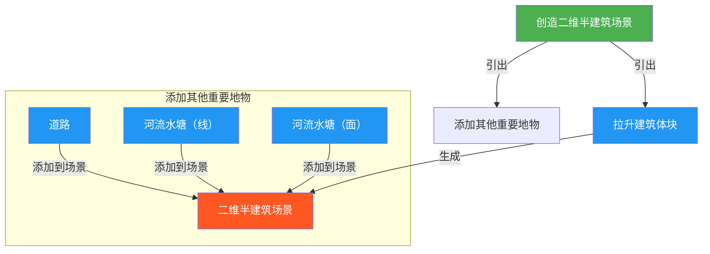

```mermaid
graph TD
    A[创造二维半建筑场景] -->|引出| B[拉升建筑体块]
    A -->|引出| C[添加其他重要地物]

    subgraph 添加其他重要地物
        C1[道路] -->|添加到场景| D[二维半建筑场景]
        C2[河流水塘（线）] -->|添加到场景| D
        C3[河流水塘（面）] -->|添加到场景| D
    end

    B -->|生成| D[二维半建筑场景]

    style A fill:#4CAF50,color:white
    style D fill:#FF5722,color:white
    classDef process fill:#2196F3,color:white;
    class B,C1,C2,C3 process
```