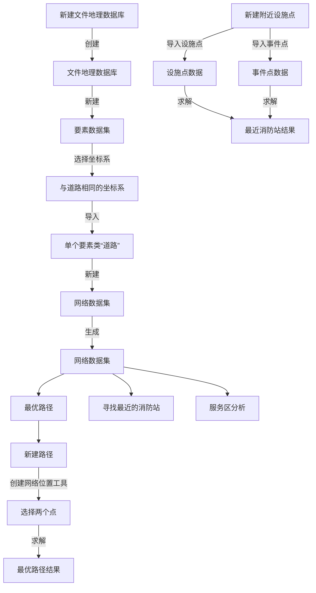

```mermaid
graph TD
    A[新建文件地理数据库] -->|创建| B[文件地理数据库]
    B -->|新建| C[要素数据集]
    C -->|选择坐标系| D[与道路相同的坐标系]
    D -->|导入| E[单个要素类“道路”]
    E -->|新建| F[网络数据集]
    F -->|生成| G[网络数据集]
    G[网络数据集] -->H[最优路径]
    G[网络数据集] -->I[寻找最近的消防站]
    G[网络数据集] -->J[服务区分析]
    H[最优路径]-->H1[新建路径]
    H1[新建路径] -->|创建网络位置工具| H2[选择两个点]
        H2 -->|求解| H3[最优路径结果]
        
    I1[新建附近设施点] -->|导入设施点| I2[设施点数据]
        I1 -->|导入事件点| I3[事件点数据]
        I2 -->|求解| I4[最近消防站结果]
        I3 -->|求解| I4
```