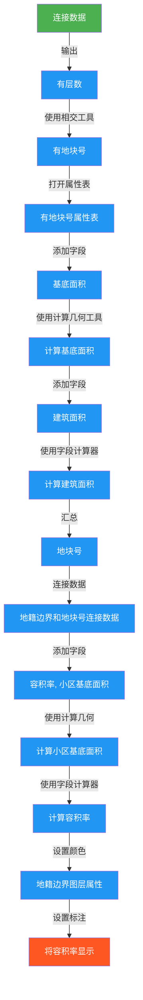

```mermaid
graph TD
    A[连接数据] -->|输出| B[有层数]
    B -->|使用相交工具| C[有地块号]
    C -->|打开属性表| D[有地块号属性表]
    D -->|添加字段| E[基底面积]
    E -->|使用计算几何工具| F[计算基底面积]
    F -->|添加字段| G[建筑面积]
    G -->|使用字段计算器| H[计算建筑面积]
    H -->|汇总| I[地块号]
    I -->|连接数据| J[地籍边界和地块号连接数据]
    J -->|添加字段| K[容积率, 小区基底面积]
    K -->|使用计算几何| L[计算小区基底面积]
    L -->|使用字段计算器| M[计算容积率]
    M -->|设置颜色| N[地籍边界图层属性]
    N -->|设置标注| O[将容积率显示]

    style A fill:#4CAF50,color:white
    style O fill:#FF5722,color:white
    classDef process fill:#2196F3,color:white;
    class B,C,D,E,F,G,H,I,J,K,L,M,N process
```