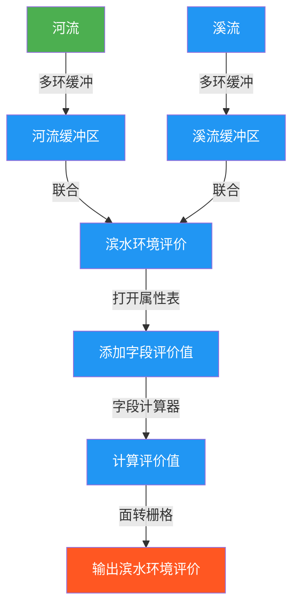

```mermaid
graph TD
    A[河流] -->|多环缓冲| B[河流缓冲区]
    C[溪流] -->|多环缓冲| D[溪流缓冲区]
    B -->|联合| E[滨水环境评价]
    D -->|联合| E
    E -->|打开属性表| F[添加字段评价值]
    F -->|字段计算器| G[计算评价值]
    G -->|面转栅格| H[输出滨水环境评价]

    style A fill:#4CAF50,color:white
    style H fill:#FF5722,color:white
    classDef process fill:#2196F3,color:white;
    class B,C,D,E,F,G process
```