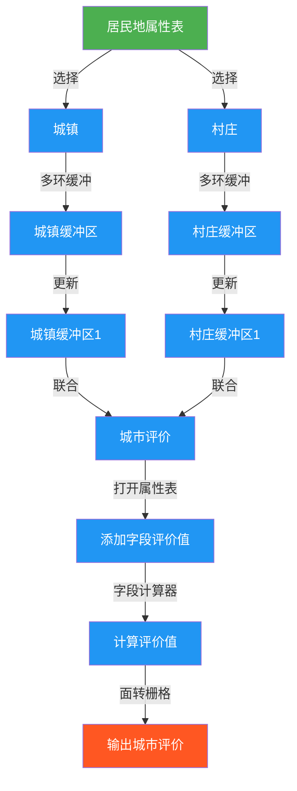

```mermaid
graph TD
    A[居民地属性表] -->|选择| B[城镇]
    B -->|多环缓冲| C[城镇缓冲区]
    C -->|更新| D[城镇缓冲区1]
    A -->|选择| E[村庄]
    E -->|多环缓冲| F[村庄缓冲区]
    F -->|更新| G[村庄缓冲区1]
    D -->|联合| H[城市评价]
    G -->|联合| H
    H -->|打开属性表| I[添加字段评价值]
    I -->|字段计算器| J[计算评价值]
    J -->|面转栅格| K[输出城市评价]

    style A fill:#4CAF50,color:white
    style K fill:#FF5722,color:white
    classDef process fill:#2196F3,color:white;
    class B,C,D,E,F,G,H,I,J process
```