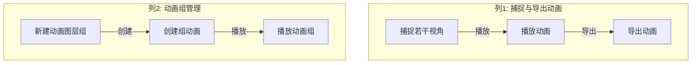

```mermaid
graph TD
    subgraph 列1: 捕捉与导出动画
        A[捕捉若干视角] -->|播放| B[播放动画]
        B -->|导出| C[导出动画]
    end

    subgraph 列2: 动画组管理
        D[新建动画图层组] -->|创建| E[创建组动画]
        E -->|播放| F[播放动画组]
    end
```