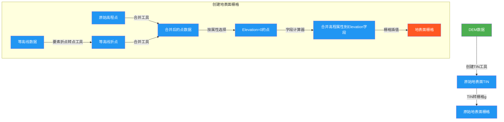

```mermaid
graph TD
    A[DEM数据] -->|创建TIN工具| B[原始地表面TIN]
    B -->|TIN转栅格g| C[原始地表面栅格]
    

    subgraph 创建地表面栅格
        D1[等高线数据] -->|要素折点转点工具| D2[等高线折点]
        D3[原始高程点] -->|合并工具| D4[合并后的点数据]
        D2 -->|合并工具| D4
        D4 -->|按属性选择| D5[Elevation=0的点]
        D5 -->|字段计算器| D6[合并高程属性到Elevation字段]
        D6 -->|栅格插值| D[地表面栅格]
    end

    style A fill:#4CAF50,color:white
    style D fill:#FF5722,color:white
    classDef process fill:#2196F3,color:white;
    class B,C,D1,D2,D3,D4,D5,D6 process
```