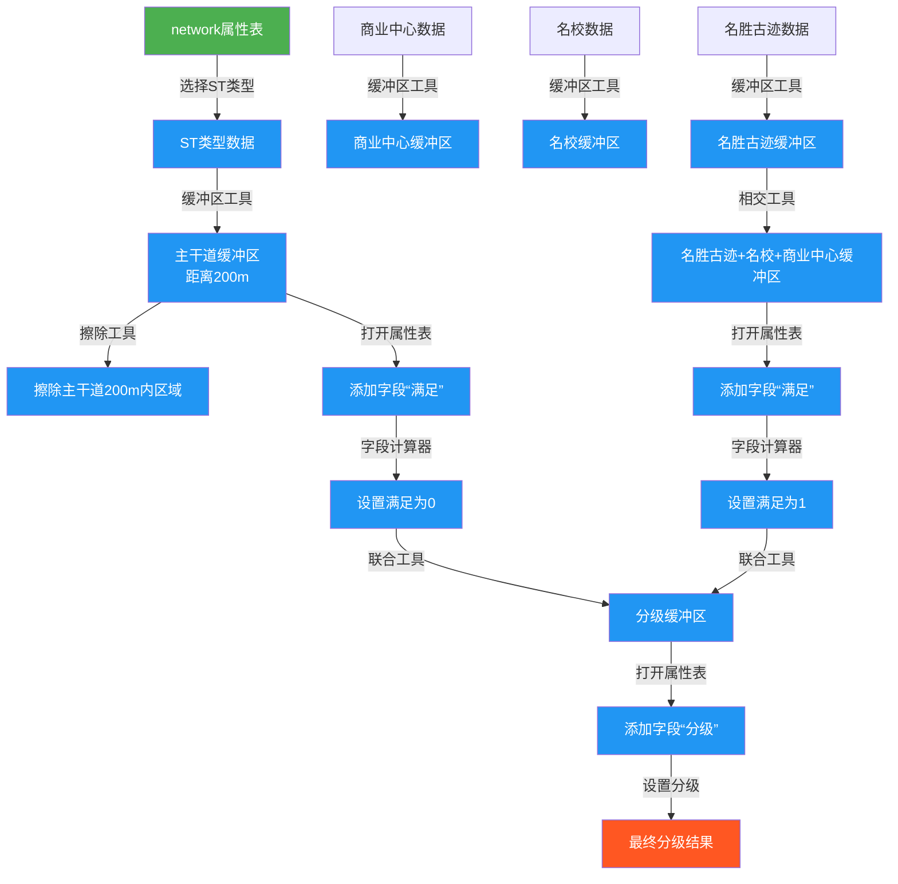

```mermaid
graph TD

        A1[network属性表] -->|选择ST类型| A2[ST类型数据]
        A2 -->|缓冲区工具| A3[主干道缓冲区<br>距离200m]
        B1[商业中心数据] -->|缓冲区工具| B2[商业中心缓冲区]
        C1[名校数据] -->|缓冲区工具| C2[名校缓冲区]

        D1[名胜古迹数据] -->|缓冲区工具| D2[名胜古迹缓冲区]
        
        D2 -->|相交工具| E1[名胜古迹+名校+商业中心缓冲区]
        A3 -->|擦除工具| E2[擦除主干道200m内区域]
        E1 -->|打开属性表| E3[添加字段“满足”]
        E3 -->|字段计算器| E4[设置满足为1]
        A3 -->|打开属性表| E5[添加字段“满足”]
        E5 -->|字段计算器| E6[设置满足为0]
        E4 -->|联合工具| E7[分级缓冲区]
        E6 -->|联合工具| E7
        E7 -->|打开属性表| E8[添加字段“分级”]
        E8 -->|设置分级| E9[最终分级结果]
    style A1 fill:#4CAF50,color:white
    style E9 fill:#FF5722,color:white
    classDef process fill:#2196F3,color:white;
    class A2,A3,B2,C2,D2,E1,E2,E3,E4,E5,E6,E7,E8 process
```