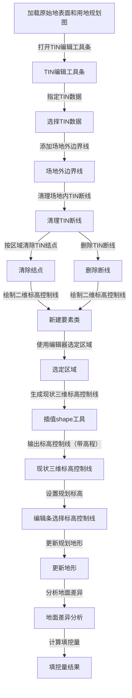

```mermaid
graph TD
    A[加载原始地表面和用地规划图] -->|打开TIN编辑工具条| B[TIN编辑工具条]
    B -->|指定TIN数据| C[选择TIN数据]
    C -->|添加场地外边界线| D[场地外边界线]
    D -->|清理场地内TIN断线| E[清理TIN断线]
    E -->|按区域清除TIN结点| F[清除结点]
    E -->|删除TIN断线| G[删除断线]
    F -->|绘制二维标高控制线| H[新建要素类]
    G -->|绘制二维标高控制线| H
    H -->|使用编辑器选定区域| I[选定区域]
    I -->|生成现状三维标高控制线| J[插值shape工具]
    J -->|输出标高控制线（带高程）| K[现状三维标高控制线]
    K -->|设置规划标高| L[编辑条选择标高控制线]
    L -->|更新规划地形| M[更新地形]
    M -->|分析地面差异| N[地面差异分析]
    N -->|计算填挖量| O[填挖量结果]
```