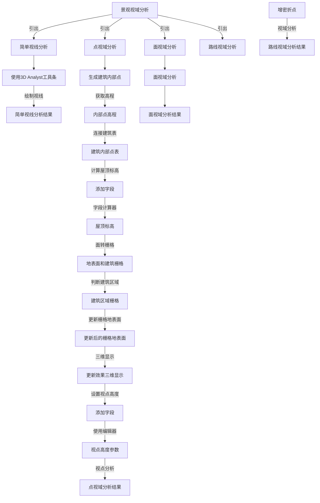

```mermaid
graph TD
    A[景观视域分析] -->|引出| B[简单视线分析]
    A -->|引出| C[点视域分析]
    A -->|引出| D[面视域分析]
    A -->|引出| E[路线视域分析]
B[简单视线分析]-->B1[使用3D Analyst工具条]
        B1[使用3D Analyst工具条] -->|绘制视线| B2[简单视线分析结果]
C[点视域分析]-->C1[生成建筑内部点]
D[面视域分析]-->D1[面视域分析]
E[路线视域分析]

        C1[生成建筑内部点] -->|获取高程| C2[内部点高程]
        C2 -->|连接建筑表| C3[建筑内部点表]
        C3 -->|计算屋顶标高| C4[添加字段]
        C4 -->|字段计算器| C5[屋顶标高]
        C5 -->|面转栅格| C6[地表面和建筑栅格]
        C6 -->|判断建筑区域| C7[建筑区域栅格]
        C7 -->|更新栅格地表面| C8[更新后的栅格地表面]
        C8 -->|三维显示| C9[更新效果三维显示]
        C9 -->|设置视点高度| C10[添加字段]
        C10 -->|使用编辑器| C11[视点高度参数]
        C11 -->|视点分析| C12[点视域分析结果]
  
        D1[面视域分析] --> D2[面视域分析结果]

        E1[增密折点] -->|视域分析| E2[路线视域分析结果]

```