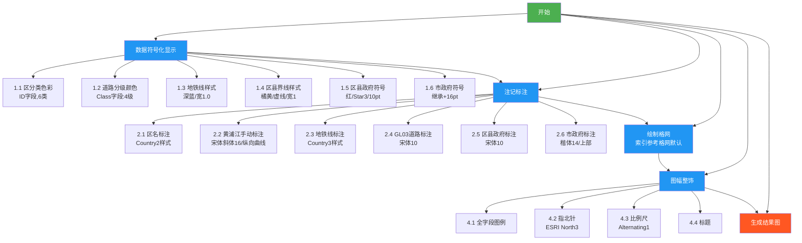

```mermaid
graph TD
    A[开始] --> B[数据符号化显示]
    B --> B1[1.1 区分类色彩<br>ID字段,6类]
    B --> B2[1.2 道路分级颜色<br>Class字段:4级]
    B --> B3[1.3 地铁线样式<br>深蓝/宽1.0]
    B --> B4[1.4 区县界线样式<br>橘黄/虚线/宽1]
    B --> B5[1.5 区县政府符号<br>红/Star3/10pt]
    B --> B6[1.6 市政府符号<br>继承+16pt]
    
    A --> C[注记标注]
    C --> C1[2.1 区名标注<br>Country2样式]
    C --> C2[2.2 黄浦江手动标注<br>宋体斜体16/纵向曲线]
    C --> C3[2.3 地铁线标注<br>Country3样式]
    C --> C4[2.4 GL03道路标注<br>宋体10]
    C --> C5[2.5 区县政府标注<br>宋体10]
    C --> C6[2.6 市政府标注<br>楷体14/上部]
    
    A --> D[绘制格网<br>索引参考格网默认]
    
    A --> E[图幅整饰]
    E --> E1[4.1 全字段图例]
    E --> E2[4.2 指北针<br>ESRI North3]
    E --> E3[4.3 比例尺<br>Alternating1]
    E --> E4[4.4 标题]
    
    A --> F[生成结果图]
    
    %% 流程顺序
    B --> C
    C --> D
    D --> E
    E --> F
    
    style A fill:#4CAF50,color:white
    style F fill:#FF5722,color:white
    classDef process fill:#2196F3,color:white;
    class B,C,D,E process
```