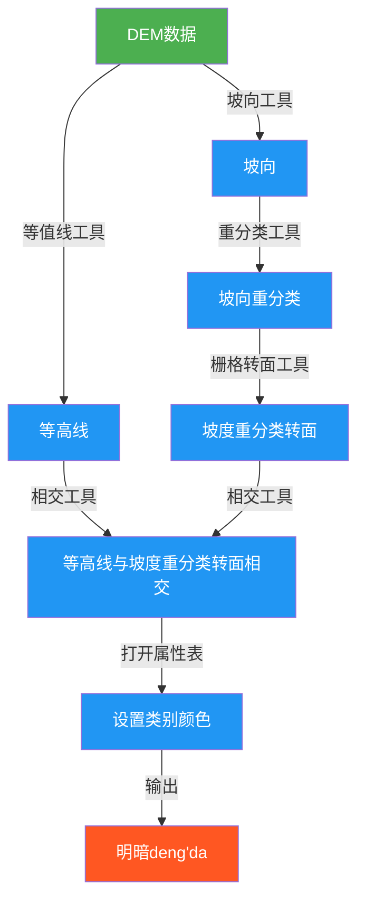

```mermaid
graph TD
    A[DEM数据] -->|等值线工具| B[等高线]
    A -->|坡向工具| C[坡向]
    C -->|重分类工具| D[坡向重分类]
    D -->|栅格转面工具| E[坡度重分类转面]
    B -->|相交工具| F[等高线与坡度重分类转面相交]
    E -->|相交工具| F
    F -->|打开属性表| G[设置类别颜色]
    G -->|输出| H[明暗deng'da]

    style A fill:#4CAF50,color:white
    style H fill:#FF5722,color:white
    classDef process fill:#2196F3,color:white;
    class B,C,D,E,F,G process
```