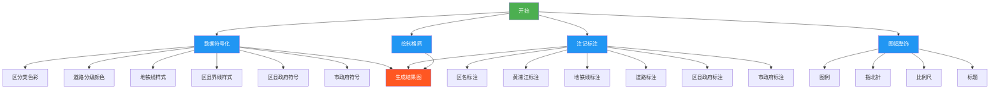

```mermaid
graph TD
    A[开始] --> B[数据符号化]
    B --> B1[区分类色彩]
    B --> B2[道路分级颜色]
    B --> B3[地铁线样式]
    B --> B4[区县界线样式]
    B --> B5[区县政府符号]
    B --> B6[市政府符号]

    A --> C[注记标注]
    C --> C1[区名标注]
    C --> C2[黄浦江标注]
    C --> C3[地铁线标注]
    C --> C4[道路标注]
    C --> C5[区县政府标注]
    C --> C6[市政府标注]

    A --> D[绘制格网]
    A --> E[图幅整饰]
    E --> E1[图例]
    E --> E2[指北针]
    E --> E3[比例尺]
    E --> E4[标题]

    B --> F[生成结果图]
    C--> F[生成结果图]
    D--> F[生成结果图]

    style A fill:#4CAF50,color:white
    style F fill:#FF5722,color:white
    classDef process fill:#2196F3,color:white;
    class B,C,D,E process
```