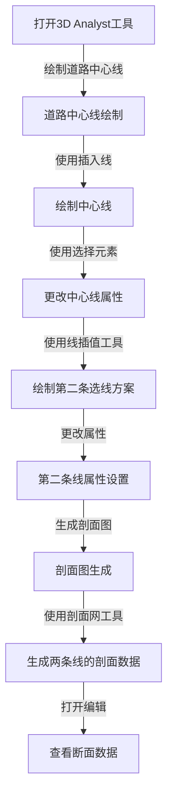

```mermaid
graph TD
    A[打开3D Analyst工具] -->|绘制道路中心线| B[道路中心线绘制]
    B -->|使用插入线| C[绘制中心线]
    C -->|使用选择元素| D[更改中心线属性]
    D -->|使用线插值工具| E[绘制第二条选线方案]
    E -->|更改属性| F[第二条线属性设置]
    F -->|生成剖面图| G[剖面图生成]
    G -->|使用剖面网工具| H[生成两条线的剖面数据]
    H -->|打开编辑| I[查看断面数据]
```