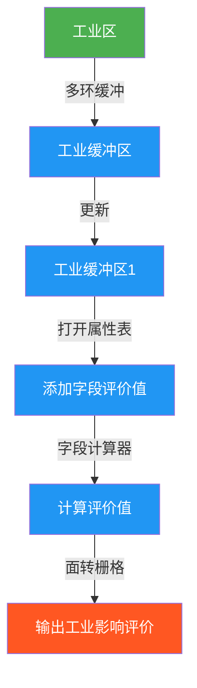

```mermaid
graph TD
    A[工业区] -->|多环缓冲| B[工业缓冲区]
    B -->|更新| C[工业缓冲区1]
    C -->|打开属性表| D[添加字段评价值]
    D -->|字段计算器| E[计算评价值]
    E -->|面转栅格| F[输出工业影响评价]

    style A fill:#4CAF50,color:white
    style F fill:#FF5722,color:white
    classDef process fill:#2196F3,color:white;
    class B,C,D,E process
```