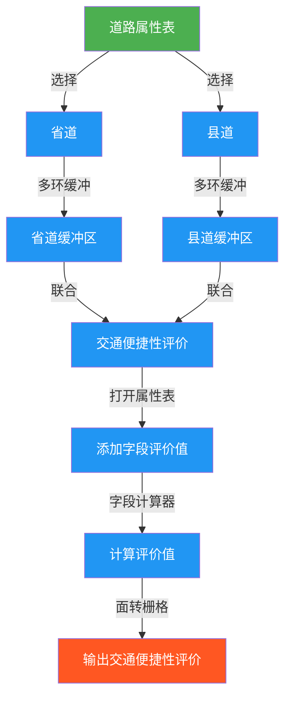

```mermaid
graph 
    A[道路属性表] -->|选择| B[省道]
    B -->|多环缓冲| C[省道缓冲区]
    A -->|选择| D[县道]
    D -->|多环缓冲| E[县道缓冲区]
    C -->|联合| F[交通便捷性评价]
    E -->|联合| F
    F -->|打开属性表| G[添加字段评价值]
    G -->|字段计算器| H[计算评价值]
    H -->|面转栅格| I[输出交通便捷性评价]

    style A fill:#4CAF50,color:white
    style I fill:#FF5722,color:white
    classDef process fill:#2196F3,color:white;
    class B,C,D,E,F,G,H process
```