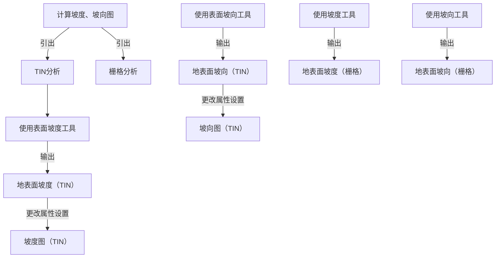

```mermaid
graph TD
    A[计算坡度、坡向图] -->|引出| B[TIN分析]
    A -->|引出| C[栅格分析]
    B[TIN分析]--> B1[使用表面坡度工具]
    
        B1[使用表面坡度工具] -->|输出| B2[地表面坡度（TIN）]
        B2 -->|更改属性设置| B3[坡度图（TIN）]
        B4[使用表面坡向工具] -->|输出| B5[地表面坡向（TIN）]
        B5 -->|更改属性设置| B6[坡向图（TIN）]

        C1[使用坡度工具] -->|输出| C2[地表面坡度（栅格）]
        C3[使用坡向工具] -->|输出| C4[地表面坡向（栅格）]

```